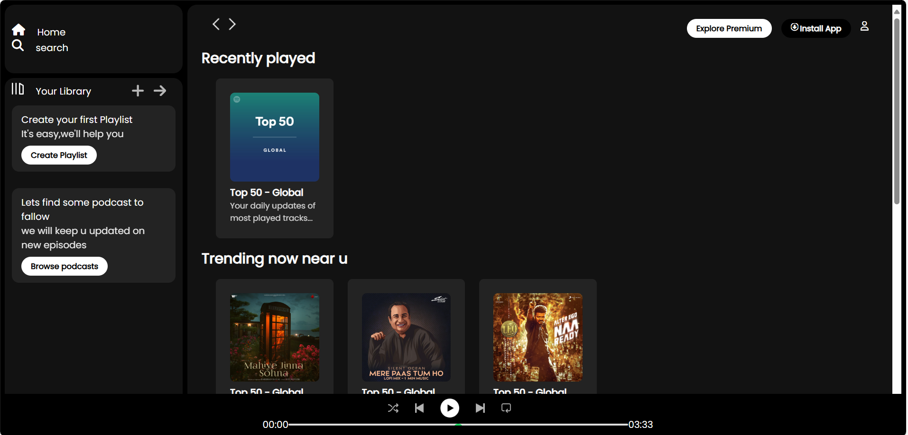

# Sleek Spotify Clone

A visually rich, responsive Spotify-inspired music streaming UI clone built using **HTML**, **CSS**, and **JavaScript**. This project focuses on front-end design, layout structure, and interaction with minimal logic.

---

## Preview

> Here's how the interface looks:



> _Dark theme, side navigation, trending songs layout, and a mini music player._

---

## 🛠️ Tech Stack

- **HTML5** – Markup structure
- **CSS3** – Custom styling, Flexbox, Grid
- **JavaScript** – Basic interactivity

---

## How to Run

1. **Clone the repository**:

```bash
git clone https://github.com/bhoomibiradar/spotify-clone.git
```

2. **Navigate to project folder**:

```bash
cd spotify-clone
```

3. **Run with Live Server** *(recommended)*:
   - Open with VS Code
   - Right-click `index.html` → **Open with Live Server**

4. **OR** double-click `index.html` to open in your browser.

---

## Credits & References

- 🎵 UI inspired by [Spotify](https://spotify.com)
- ✨ Icons from [Font Awesome](https://fontawesome.com) or custom SVGs
- 🔤 Fonts via [Google Fonts](https://fonts.google.com)

---

## Author

Made with ❤️ by [Bhoomi](https://github.com/bhoomibiradar)  
[Portfolio Website](https://your-portfolio-link.com)

---

## License

This project is open source and free to use for educational purposes.
